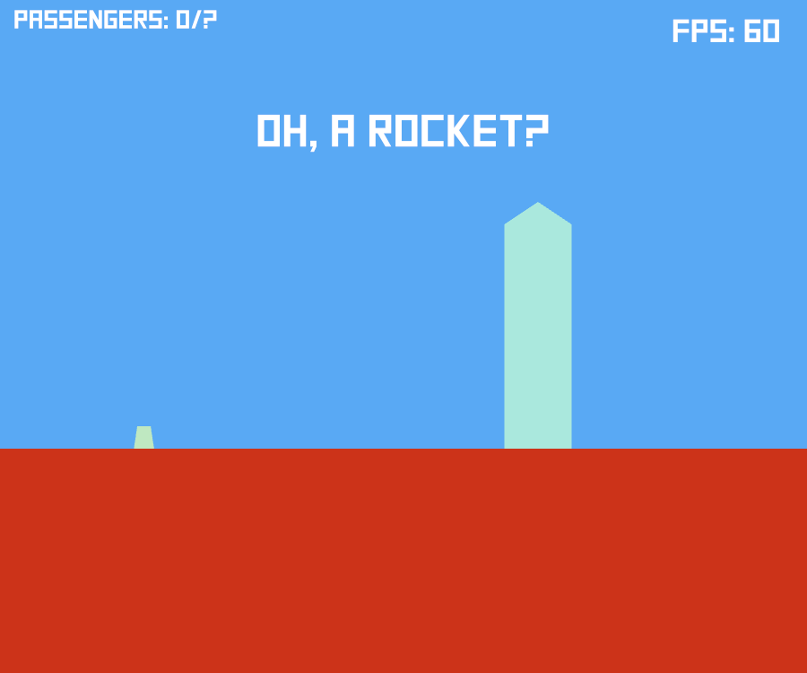
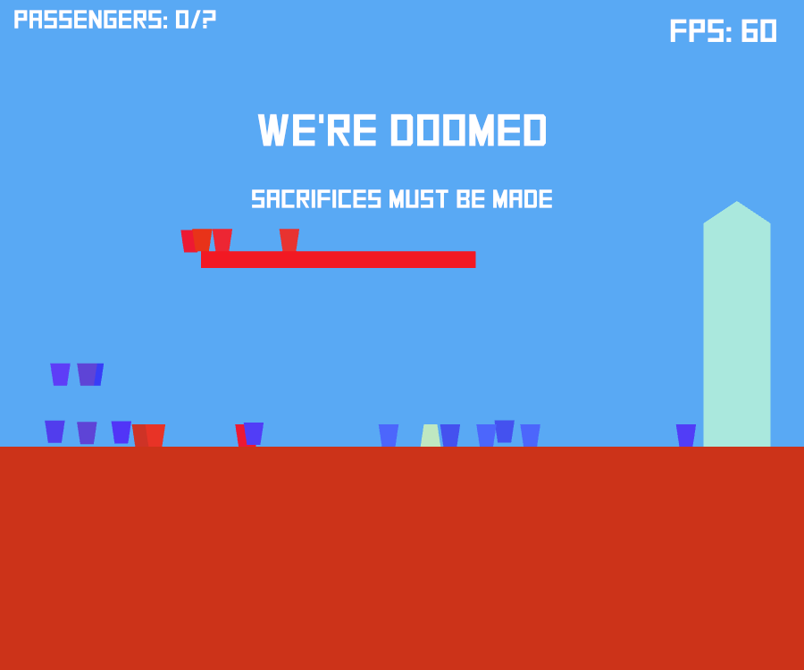

# Fuite

A game where you have to escape... but will everybody make it?

[Ludum Dare 43](https://ldjam.com/events/ludum-dare/43):
Sacrifices must be made.

**Controls**:
 - Click on Hums to control them:
   - Left click: go to your left.
   - Right right: go to your other left.
 - R: restart the current level.

For players stuck with a touch-pad:
 - Click + Space = right click.

*No sound... Sorry :/*

## Screenshots

## How to run the game?
You can download a bundled version of the game on
[GitHub](https://github.com/totorigolo/fuite-rs/releases).

**Note**: Doesn't seem to work on Wayland, use X instead.

## How to build the game?
 - Install Rust ([rustup](https://rustup.rs/) is the easy way).
 - You need the Nightly version: `rustup install nightly`.
 - Go check the [Amethyst README](https://github.com/amethyst/amethyst).
 - `git clone https://github.com/totorigolo/fuite.git`
 - `cargo +nightly run`

## License
This game is license under the [MIT License](LICENSE).
